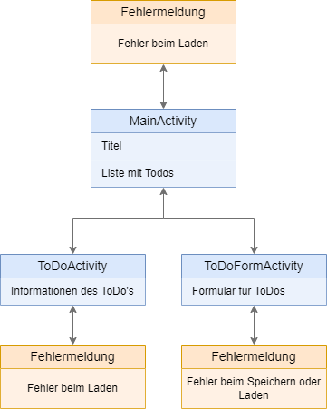
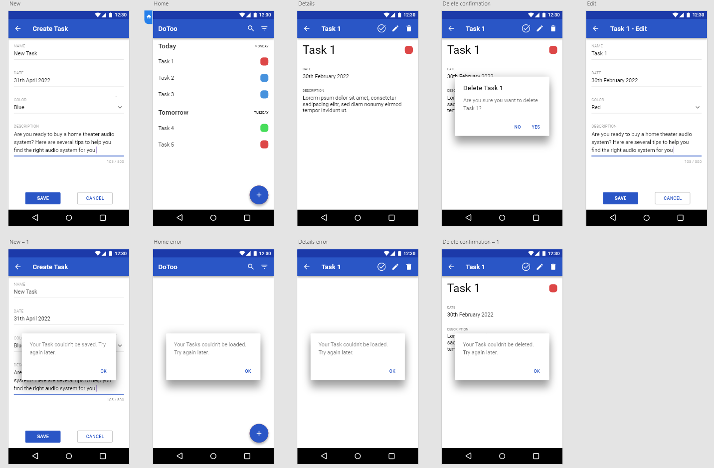

# DoTooo

## Inhalt

- [DoTooo](#dotooo)
  - [Inhalt](#inhalt)
  - [1 Abstract (Kurzbeschreibung)](#1-abstract-kurzbeschreibung)
  - [2 Konkurrenzanalyse](#2-konkurrenzanalyse)
  - [3 User Storys](#3-user-storys)
  - [Optional](#optional)
  - [4 Mockups und App Struktur](#4-mockups-und-app-struktur)
  - [5 Technische Realisierung](#5-technische-realisierung)
  - [6 Fazit](#6-fazit)

## 1 Abstract (Kurzbeschreibung)

Eine Simple ToDo-App, um zu erledigende Aufgaben zu organisieren. Man kann Aufgaben erstellen, ansehen und als erledigt
markieren. Auf der Startseite werden alle Aufgaben in einer Liste dargestellt. In der Menuleiste ist eine Lupe zu sehen
mit welcher man nach Aufgaben suchen kann. Neben der Lupe ist ein Meatballmenu zu sehen, bei welchem man Filter
einstellen kann. Durch einen FloatingButton am unteren rechten Rand der App, gelangt man zum Screen, auf welchem man
eine neue Aufgabe erstellen kann. Mit einem Klick auf ein Listenelement gelangt man zur Detailseite der jeweiligen
Aufgabe. Auf der Detailseite kann man eine Aufgabe als erledigt markieren, editieren, löschen und die Detailbeschreibung
der Aufgabe sehen. Um die Aufgaben nach Wichtigkeit zu sortieren, kann man einer Aufgabe eine Farbe zuweisen. Zudem kann
einer Aufgabe eine Zeit zugewiesen werden.

## 2 Konkurrenzanalyse

Konkurrenz-Apps:

- [Microsoft ToDo's](https://play.google.com/store/apps/details?id=com.microsoft.todos&hl=de_CH&gl=US)
- [Google Tasks](https://play.google.com/store/apps/details?id=com.google.android.apps.tasks&hl=de_CH&gl=US)

Was macht die Konkurrenz gut:

- Modernes, übersichtliches Design und einfache Bedienung
- App ist allgemein einfach und zweckdienlich gehalten
- Kompabilität mit anderen Produkten des Anbieters (z.B. Google Kalender)
- Viele verschiedene Funktionalitäten
- Plattformübergreifend/Geräteübergreifend
- Viele Anpassungsmöglichkeiten
- Kostenfrei

Was macht die Konkurrenz schlecht:

- Nicht vertraulicher Umgang mit Daten
- Anmeldung/Registrierung erforderlich

Wie können wir uns von der Konkurrenz abheben:

- Klar signalisierter Umgang mit User-Daten
- anderes Design

## 3 User Storys

| Rolle        | Ziel                                             | Nutzen                                              | Akzeptanzkriterien                                                                                                                |
|--------------|--------------------------------------------------|-----------------------------------------------------|-----------------------------------------------------------------------------------------------------------------------------------|
| Als Benutzer | möchte ich alle ToDo's angezeigt bekommen        | um eine Übersicht haben zu können                   | Unerledigte (wenn kein Filter eingestellt ist) ToDo's werden minimalistisch, untereinander aufgelistet (scrollbar).               |
| Als Benutzer | möchte ich die Details eines Todo's sehen können | um alle Informationen sehen zu können               | Alle Informationen des ToDo's werden vollständig angezeigt, ohne zu scrollen.                                                     |
| Als Benutzer | möchte ich ToDo's erstellen können               |                                                     | Mit einer Erstellseite können ToDo's mit der eingegebenen Informationen erstellt werden.                                          |
| Als Benutzer | möchte ich ToDo's löschen können                 |                                                     | Auf der Detailseite kann man das ToDo löschen. Das Löschen muss bestätigt werden.                                                 |
| Als Benutzer | möchte ich ToDo's editieren können               |                                                     | Auf der Detailseite kann man zu einer Editierseite weiter geleitet werden, wo die Informationen des ToDos editiert werden können. |
| Als Benutzer | möchte ich ToDo's suchen können                  | um nur die gewünschten Todo's angezeigt zu bekommen | Todos werden auf der Hauptseite nur angezeigt, wenn Titel oder Beschreibung die im Suchfeld eingegebene Wörter enthalten.         |
| Als Benutzer | möchte ich ToDo's filtern können                 | um nur die gewünschten Todo's angezeigt zu bekommen | Todos werden auf der Hauptseite nur angezeigt, wenn sie das ausgewählte Kriterium erfüllen. -> schon erledigt, alle, Farbe        |
| Als Benutzer | möchte ich ein ToDo als erledigt kennzeichnen    |                                                     | Auf der Detailseite kann ein ToDo als erledigt markiert werden.                                                                   |

## Optional

| Rolle        | Ziel                                                                   | Nutzen                              | Akzeptanzkriterien                                                                                          |
|--------------|------------------------------------------------------------------------|-------------------------------------|-------------------------------------------------------------------------------------------------------------|
| Als Benutzer | möchte ich ein ToDo in der Hauptseite als erledigt kennzeichnen können | um schneller zu sein                | Ein ToDo kann auch in der Hauptseite als erledigt markiert werden.                                          |
| Als Benutzer | möchte ich ein ToDo direkt von der Hauptseite editieren                | um schneller beim Editieren zu sein | Von der Hauptseite aus kann man, ohne in die Detailseite navigieren zu müssen, in die Editierseite gelangen. |

## 4 Mockups und App Struktur

> ***1. MainActivity***  
> In der MainAcitivity werden alle ausstehenden ToDO's angezeigt. Ja nach dem wie der Benutzer die Filter einstellt sind nur spezifische ToDos zu sehen. Zudem ist eine Suchfunktion vorhanden. Zudem wird die Farbe/Wichtigkeit des ToDo's angezigt.  
> ***2. ToDoACtivity*** 
> Wenn der Benutzer in der MainActivity auf ein ToDo klickt, gelangt er zu dieser Seite. Auf dieser Seite werden dem Benutzer alle Daten von dem gewählten ToDo angezeigt. In der Navigationsleiste werden zudem drei Icons angezeigt. Ein Icon um die Aufgabe als erledigt zu markieren, ein Icon um das ToDo zu bearbeiten, und ein Icon um das ToDO zu löschen.  
> ***3. ToDoFormActivity*** 
> Auf dieser Seite befindet sich das Formular zum Erstellen oder Bearbeiten eines ToDO's. Es sind zwei Buttons vorhanden. Neben den Formularen ist ein Button zum Speichern vorhanden. 

## 5 Technische Realisierung

Unsere Komplexe Komponente ist eine Room Datenbank. In ihr ist eine Entität, die ToDo's, vorhanden. 
Am wichtigsten sind die Klassen TaskRoomDatabase und TaskRoomDao. In der Klasse TaskRoomDatabase wird die Datenbank an sich erstellt. Zudem kann man durch die TaskRoomDatabse Klasse eine Datenkabnk Instanz erhalten. Im Interface TaskRoomDao sind die Funktionen enthalten durch welche man mit der Datenbank interagieren kann.

## 6 Fazit
