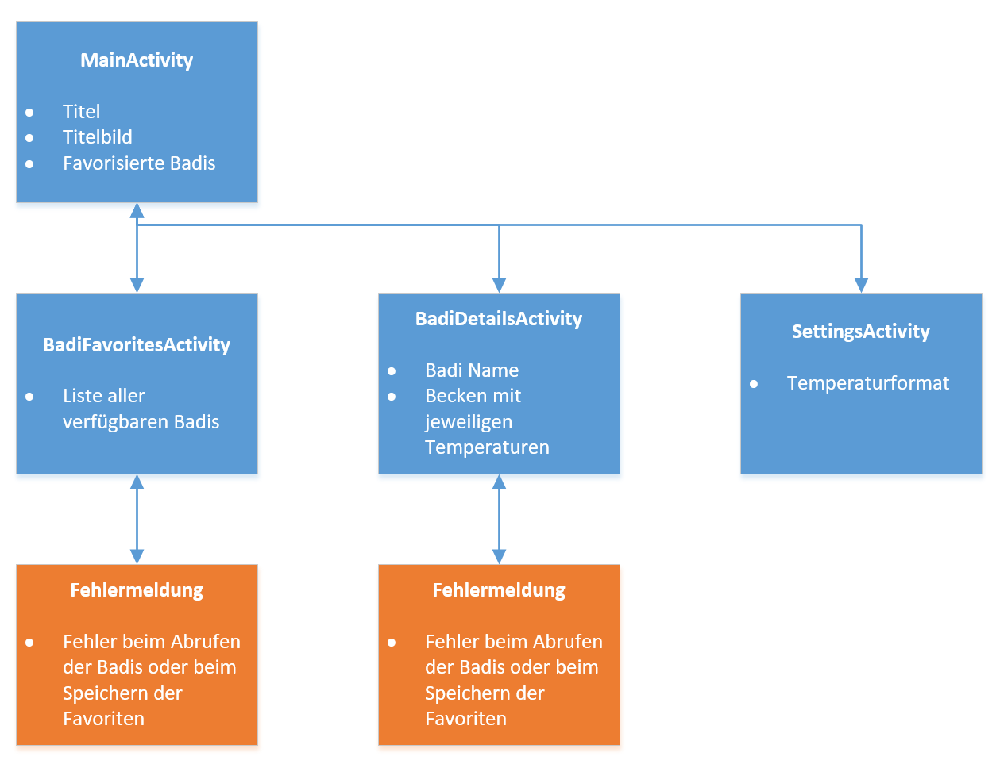
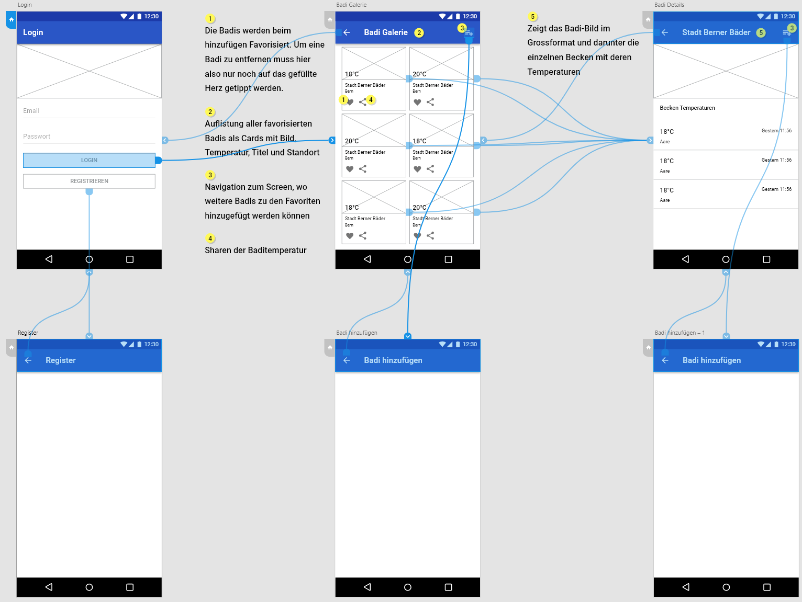

# ***App-/Projektname***
> *Alles was schräg geschrieben ist und/oder mit einem > als Quote steht wird mit euren Texten ersetzt!*  
> *Den vorhandenen Text löschen.*  
> *Mindestens die bestehenden Überschriften müssen vorhanden sein. Es kann jedoch immer noch erwetert werden je nach Projekt.*  

> *Kann auch in einzelne Files ausgelagert werden und im **[Readme](README.md)** verlinkt werden.*

## Inhalt

* [1 Abstract (Kurzbeschreibung)](#1-abstract-kurzbeschreibung)
* [2 Konkurrenzanalyse](#2-konkurrenzanalyse)
* [3 User Storys](#3-user-storys)
* [4 Mockups und App Struktur](#4-mockups-und-app-struktur)
* [5 Technische Realisierung](#5-technische-realisierung)
* [6 Fazit](#6-fazit)

# 1 Abstract (Kurzbeschreibung)

> *An dieser Stelle kommt eine kurze Einführung, die in 5-10 Sätzen das Projekt beschreibt.*

# 2 Konkurrenzanalyse

> *Konkurrenzanalyse des Auftrages.*

# 3 User Storys

> *Als \<Rolle\> möchte ich \<Ziel/Wunsch\>, um \<Nutzen\>.*

# 4 Mockups und App Struktur

> ***1. Startactivity***  
> *Innerhalb der StartActivity wird dem Benutzer zentral ein Login-Formular  präsentiert. Oberhalb des Formulars wird das Logo der App platziert. Die Eingabefelder sollten möglichst in den oberen zwei Drittel des Bildschirms platziert werden damit die Tastatur diese nicht überdeckt.
> Unter den Eingabefelder sind zwei Buttons platziert, «Login» und «Registrieren». Dabei soll der Login-Button farblich hervorgehoben werden da dieser öfters benutzt wird. Der «Registrieren»-Button wird im Normalfall einmal benutzt deshalb soll dieser neutral oder sogar weniger prominent dargestellt werden.*

> ***2.	Badi-Galerie***  
> *In der «Badi-Galerie»-Ansicht wird dem Benutzer ein Grid mit den favorisierten Schwimmbäder angezeigt. Jedes einzelne Schwimmbad wird mit einem Bild präsentiert. In der in der unteren Ecke jedes Bildes wird die aktuelle Temperatur angezeigt. Darunter den Namen der Badi und der Ort. In der Auflistung muss auf und ab navigiert werden können da man mehr Schwimmbäder hinzufügen kann als auf dem Display Platz haben. Ein Floating-Action-Button mit einem Plus-Icon ist unten rechts am Screen platziert um neue Schwimmbäder in die eigene Liste aufzunehmen. In der Actionbar am oberen Rand wird rechts ein Kontextmenü platziert welches mit dem entsprechenden Button geöffnet werden kann. Darin sind die Punkte Einstellungen, Hilfe und Logout zu finden.*

> ***3. Badidetails***   
> ...

> ***4. Badiauswahl***   
> ...

> ***5. Registration***   
> ...

# 5 Technische Realisierung

> *Beschreibt hier, wie ihr eure komplexe Komponente technisch umgesetzt habt. Zur Darstellung der technischen Umsetzung wird ein UML-Diagramm empfohlen, welches zusätzlich in Textform beschrieben wird. Erklärt kurz die wichtigsten Klassen und Methoden und deren Zusammenspiel. Eine Fachperson, welche dieses Kapitel liest, sollte schnell nachvollziehen können, wie die externe Komponente realisiert wurde.*

# 6 Fazit

> *Hier kommt eure Reflexion zum Projekt*
> * *Was lief gut/schlecht?*
> * *Wie seid ihr mit dem Ergebniss zufrieden?*
> * *Was habt ihr gelernt?*
> * *War alles vorhanden oder was fehlte noch?*
> * *Usw.*
